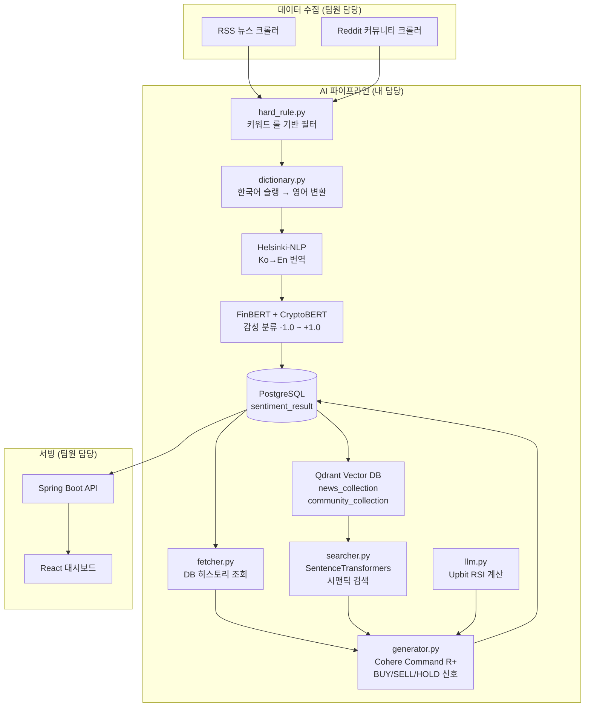

# goorm-ai-contribution

> **협업 프로젝트(HeartBit)에서 내가 직접 담당한 AI 기능 코드 모음**
>
> 원본 레포: [be-groom-python](https://github.com/zeus1560/be-groom-python) · [be-goorm-project](https://github.com/zeus1560/be-goorm-project) · [fe-goorm-project](https://github.com/zeus1560/fe-goorm-project)
>
> HeartBit은 뉴스·커뮤니티 감성 분석과 LLM 기반 투자 리포트 생성으로 암호화폐 매매 신호를 제공하는 팀 프로젝트입니다.
> 이 레포는 그 중 **내(zeus1560)가 단독 설계·구현한 AI/ML 파이프라인**만을 추출해 정리한 것입니다.

---

## 내가 담당한 AI 기능 요약

| 모듈 | 파일 | 설명 |
|------|------|------|
| 감성 분석 | `src/analysis/sentiment_analyzer.py` | FinBERT + CryptoBERT 멀티모델 감성 분류 |
| 한국어 전처리 | `src/analysis/dictionary.py` | 암호화폐 한국어 슬랭 영어 변환 (40+ 단어) |
| 룰 기반 필터 | `src/analysis/hard_rule.py` | 키워드 기반 감성 오버라이드 규칙 엔진 |
| LLM 리포트 생성 | `src/analysis/llm.py` | Cohere Command R+로 BUY/SELL/HOLD 신호 생성 |
| 벡터 검색 | `src/agent/searcher.py` | SentenceTransformers + Qdrant 시맨틱 검색 |
| 컨텍스트 수집 | `src/agent/fetcher.py` | PostgreSQL에서 뉴스·커뮤니티 히스토리 조회 |
| 리포트 오케스트레이션 | `src/agent/generator.py` | RSI 계산 + 벡터 검색 + LLM 통합 파이프라인 |
| 벡터 DB 초기화 | `src/vectordb/qdrant_setup.py` | Qdrant 컬렉션 생성 (코사인 유사도) |
| 데이터 마이그레이션 | `src/vectordb/migrate_to_qdrant.py` | PostgreSQL → Qdrant 임베딩 마이그레이션 |

---

## 아키텍처



---

## 주요 기술 구현 상세

### 1. 감성 분석 파이프라인 (`sentiment_analyzer.py`)

4단계 처리로 한국어 암호화폐 텍스트를 정확하게 분류:

1. **Hard Rule 필터** — "떡락" → -0.99, "떡상" → +0.99 즉시 분류
2. **슬랭 사전 변환** — 40+ 한국어 암호화폐 용어를 영어로 치환
3. **Ko→En 번역** — Helsinki-NLP/opus-mt-ko-en 모델로 번역
4. **FinBERT / CryptoBERT 분류** — 금융 도메인 특화 BERT로 감성 점수 산출

```python
# 사용 모델
"ProsusAI/finbert"              # 금융 뉴스 감성
"ElKulako/cryptobert"           # 암호화폐 특화 감성
"Helsinki-NLP/opus-mt-ko-en"    # 한→영 번역
```

### 2. LLM 투자 리포트 생성 (`generator.py` + `llm.py`)

- Upbit API에서 200일치 캔들 데이터 수신 → **RSI 지표 계산**
- Qdrant에서 관련 뉴스·커뮤니티 임베딩 **시맨틱 검색**
- PostgreSQL 감성 점수와 통합 → **Cohere Command R+**로 BUY/SELL/HOLD 신호 생성
- 30분 스케줄로 자동 실행, 결과를 `sentiment_result` 테이블에 저장

### 3. 벡터 DB (Qdrant)

- SentenceTransformers `multilingual-e5-small` (384차원) 임베딩
- `news_collection` · `community_collection` 두 컬렉션 분리 관리
- PostgreSQL 기존 데이터를 배치(100건)로 Qdrant에 마이그레이션

---

## 기술 스택


---

## 팀 내 역할

| 담당자 | 역할 |
|--------|------|
| **나 (zeus1560)** | AI/ML 파이프라인 전체 — 감성 분석, LLM 리포트, 벡터 DB |
| 팀원 A | Spring Boot 백엔드 API (`be-goorm-project`) |
| 팀원 B | React 프론트엔드 대시보드 (`fe-goorm-project`) |
| 팀원 C | 뉴스·커뮤니티 데이터 크롤러 |
