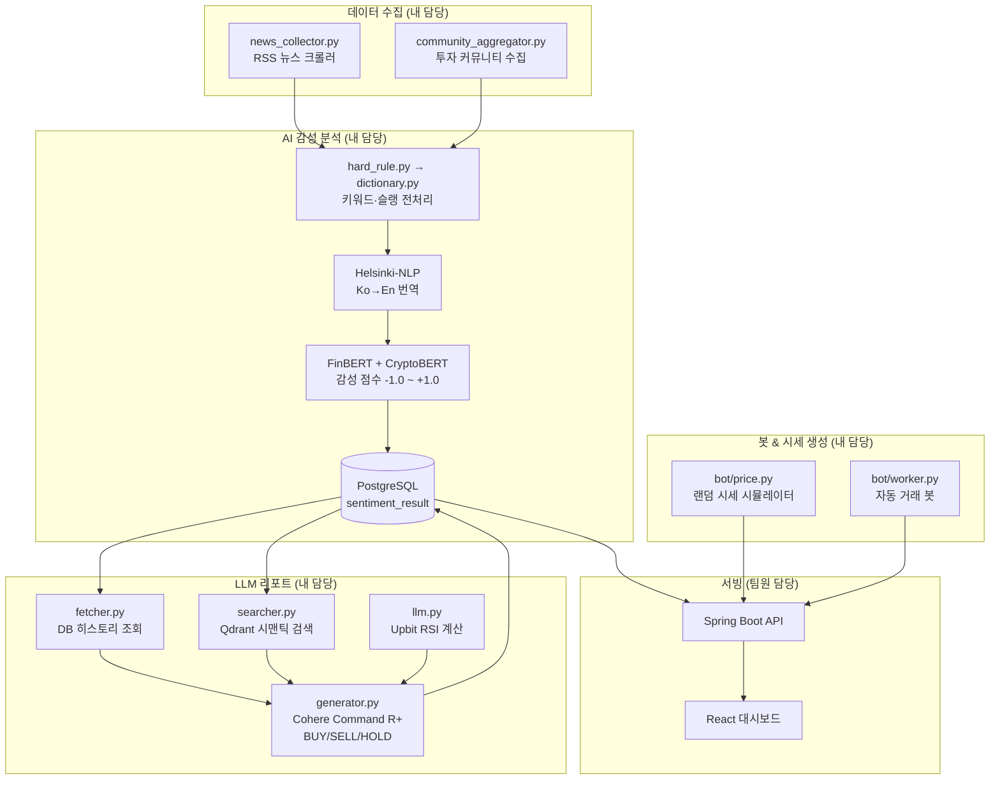

# goorm-ai-contribution

> **협업 프로젝트(HeartBit)에서 내가 담당한 Python 백엔드 전체 코드**
>
> 원본 레포: [be-groom-python](https://github.com/zeus1560/be-groom-python) · [be-goorm-project](https://github.com/zeus1560/be-goorm-project) · [fe-goorm-project](https://github.com/zeus1560/fe-goorm-project)
>
> HeartBit은 뉴스·커뮤니티 감성 분석과 LLM 기반 투자 리포트 생성으로 암호화폐 매매 신호를 제공하는 팀 프로젝트입니다.
> **`be-groom-python`(Python 백엔드 전체)은 내(zeus1560)가 단독 설계·구현**했습니다.

---

## 코드 구조

```
goorm-ai-contribution/
├── bot/                        # 거래 봇 & 랜덤 시세 생성
│   ├── price.py                # 랜덤 시세 시뮬레이터 (Upbit 클론용 가격 생성)
│   ├── interpolator.py         # 가격 보간 로직
│   ├── order.py                # 주문 처리
│   ├── worker.py               # 봇 워커 스케줄러
│   ├── category_sync.py        # 카테고리 동기화
│   └── config.py               # 봇 설정
├── src/
│   ├── main.py                 # 전체 파이프라인 진입점
│   ├── analysis/               # AI 감성 분석 파이프라인
│   │   ├── sentiment_analyzer.py  # FinBERT + CryptoBERT 감성 분류
│   │   ├── dictionary.py          # 한국어 암호화폐 슬랭 사전 (40+)
│   │   ├── hard_rule.py           # 키워드 룰 기반 감성 오버라이드
│   │   └── llm.py                 # Cohere LLM BUY/SELL/HOLD 신호 생성
│   ├── agent/                  # LLM 리포트 오케스트레이션
│   │   ├── generator.py           # RSI + 벡터검색 + LLM 통합 파이프라인
│   │   ├── fetcher.py             # PostgreSQL 히스토리 조회
│   │   └── searcher.py            # Qdrant 시맨틱 검색
│   ├── collectors/             # 데이터 수집
│   │   ├── news_collector.py      # RSS 뉴스 크롤러
│   │   ├── news_aggregator.py     # 뉴스 집계
│   │   ├── community_aggregator.py  # 커뮤니티 집계
│   │   ├── community_investing.py   # 인베스팅닷컴 커뮤니티 수집
│   │   └── upbit_market.py        # Upbit 마켓 데이터 수집
│   ├── vertordb/               # 벡터 DB
│   │   ├── qdrant_setup.py        # Qdrant 컬렉션 초기화
│   │   ├── migrate_to_qdrant.py   # PostgreSQL → Qdrant 마이그레이션
│   │   └── sync_qdrant.py         # 동기화 상태 확인
│   └── test/                   # 검증 스크립트
├── run_bot.py                  # 봇 실행 엔트리포인트
├── start_all.sh                # 전체 서비스 시작 스크립트
├── stop.sh                     # 전체 서비스 종료 스크립트
└── requirements.txt            # 의존성
```

---

## 내가 담당한 기능 요약

| 영역 | 주요 파일 | 설명 |
|------|-----------|------|
| **랜덤 시세 생성** | `bot/price.py`, `bot/interpolator.py` | Upbit 클론 프론트에 공급할 랜덤 가격 시뮬레이션 |
| **거래 봇** | `bot/order.py`, `bot/worker.py` | 자동 주문 처리 및 스케줄 실행 |
| **뉴스 크롤러** | `src/collectors/news_*.py` | RSS 기반 실시간 뉴스 수집 |
| **커뮤니티 크롤러** | `src/collectors/community_*.py` | 투자 커뮤니티 게시글 수집 |
| **감성 분석** | `src/analysis/sentiment_analyzer.py` | FinBERT + CryptoBERT 멀티모델 분류 |
| **한국어 전처리** | `src/analysis/dictionary.py`, `hard_rule.py` | 슬랭 사전 + 룰 기반 필터 |
| **LLM 리포트** | `src/analysis/llm.py`, `src/agent/generator.py` | Cohere로 BUY/SELL/HOLD 신호 생성 |
| **벡터 DB** | `src/vertordb/`, `src/agent/searcher.py` | Qdrant + SentenceTransformers RAG |

---

## 아키텍처



---

## 주요 기술 구현 상세

### 1. 랜덤 시세 생성 (`bot/price.py`, `bot/interpolator.py`)
- Upbit 클론 프론트엔드에 실시간 가격 데이터를 공급하기 위한 랜덤 시세 시뮬레이터
- 보간(interpolation) 로직으로 자연스러운 가격 변동 곡선 생성

### 2. 감성 분석 파이프라인 (`src/analysis/`)
4단계 처리로 한국어 암호화폐 텍스트를 정확하게 분류:
1. **Hard Rule** — "떡락" → -0.99, "떡상" → +0.99 즉시 분류
2. **슬랭 사전** — 40+ 한국어 암호화폐 용어 영어 치환
3. **번역** — Helsinki-NLP/opus-mt-ko-en
4. **BERT 분류** — FinBERT(뉴스) / CryptoBERT(커뮤니티)

### 3. LLM 투자 리포트 (`src/agent/generator.py` + `src/analysis/llm.py`)
- Upbit API 200일치 캔들 → RSI 계산
- Qdrant 시맨틱 검색으로 관련 컨텍스트 조회
- **Cohere Command R+** 로 BUY/SELL/HOLD + 신뢰도(0~100) 생성
- 30분 스케줄 자동 실행

---

## 기술 스택


---

## 팀 내 역할

| 담당자 | 역할 |
|--------|------|
| **나 (zeus1560)** | **Python 백엔드 전체** — 랜덤 시세 생성, 거래 봇, 크롤러, 감성 분석, LLM 리포트, 벡터 DB (`be-groom-python` 전체) |
| 팀원 A | Spring Boot 백엔드 API (`be-goorm-project`) |
| 팀원 B | React 프론트엔드 대시보드 (`fe-goorm-project`) |
